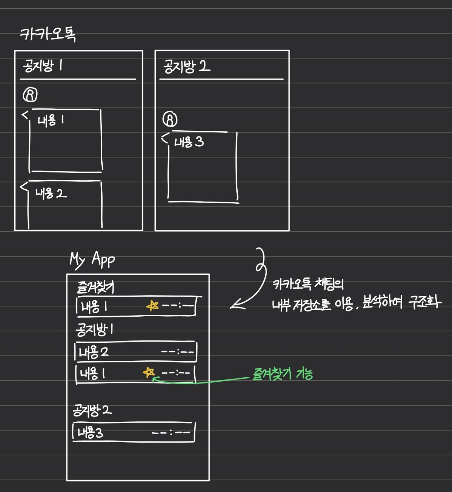

# Pitch

<!-- Under 500 words. -->

## Problem

첨단융합학부 학생회에서 이전에 공지한 내용을 다시 확인하기 위해 카카오톡을 사용했다.
그러나 새로운 공지들이 올라오며 이전에 공지한 내용이 밀려나서 찾기 어려웠다.

## Who else?

친구도 전기정보공학부 학생회에서 이전에 공지한 내용을 다시 확인할 때,
공지가 길고, 많아서 불편했으며, 이전에 공지한 내용이 위로 올라가서 찾기 어려웠다고 한다.

## Existing solutions

공지가 올라오자마자 이를 메모장 또는 캘린더에 기록하는 방법이 있다.
하지만 글의 양이 너무 많거나, 바쁘거나 급한 상황에선 쉽지 않다.

카카오톡의 '나에게로 보내기', '책갈피' 기능을 이용하는 방법이 있다.
하지만 여러 공지 채팅방을 사용하는 경우에는 채팅방을 하나 하나 들어가봐야 한다.

## Solution

카카오톡에서 올라온 공지사항을 정리하고 한 눈에 보여주는 앱을 제작한다.

## No-gos

- 공지 내용을 자동으로 분석하여 요약하거나 캘린더에 등록하는 기능은 만들지 않는다.
- 카카오톡 외 다른 채팅 서비스(Discord, Line 등)은 지원하지 않는다.
- 사용자 계정을 이용해 다른 기기에서 내용이 연동되는 기능은 만들지 않는다.
